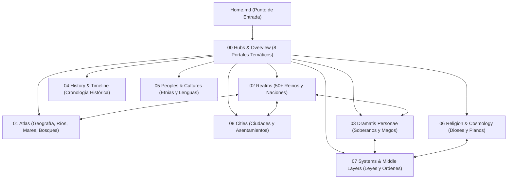

---
tags:
  - greyhawk/home
  - greyhawk/portal
aliases:
  - "Home"
  - "Inicio"
  - "World of Greyhawk"
  - "Portada"
  - "Bienvenida"
  - "Home Page"
type: home
region: Flanaess / Oerth
status_576CY: "Año Canónico 576 CY — Era de la Paz Tensa"
sources:
  - "[[WorldofGreyhawk_I.pdf|World of Greyhawk Vol. I (Gazetteer)]]"
  - "[[WorldofGreyhawk_II.pdf|World of Greyhawk Vol. II (Glossography)]]"
---

# El Mundo de Greyhawk — Bóveda de Campaña (576 CY)

> *"Más allá de las colinas de los túmulos y los pantanos brumosos se extiende un continente forjado por el fuego de imperios caídos, donde reyes decadentes conspiran en tronos de malaquita, archimagos vigilan el frágil equilibrio del cosmos y héroes sin nombre desafían las criptas del terror."*
> — **E. Gary Gygax**, *World of Greyhawk* (1980 / 1983)

![[greyhawk-catalogue-cover.jpg|677]]

---

## 1. Propósito de la Bóveda

Esta bóveda de Obsidian es un **compendio enciclopédico de referencia canónica e interactiva** ambientado en el mundo de **Greyhawk (Oerth)**, enfocado específicamente en el año canónico **576 CY (Common Year)**, el momento álgido de intriga, misterio y peligro previo a las Guerras de Greyhawk.

### Objetivos Clave:
1. **Fidelidad Canónica Total**: Toda la información procede de las fuentes fundacionales originales de Gary Gygax de TSR (*World of Greyhawk Gazetteer de 1980*, *Glossography de 1983*, módulos clásicos *T1-4*, *G1-3*, *D1-3*, *S1-4* y suplementos canónicos tempranos).
2. **Arquitectura Relacional (Second Brain)**: Cada nación, río, bosque, deidad, soberano, orden militar y ciudadela se encuentra interconectada mediante enlaces bidireccionales (`[[wikilinks]]`), eliminando islas de información y permitiendo explorar ramificaciones políticas, geográficas o religiosas de manera instantánea.
3. **Mecánicas Feudales y Geopolíticas**: Además de la información narrativa tradicional, la bóveda modela relaciones de vasallaje, lealtad dinástica, perfiles de tiranía/autoridad y redes de comercio, siendo ideal tanto para dirigir partidas de rol clásicas (AD&D, 5e, OSR) como para campañas de estrategia o gestión dinástica.

---

## 2. Cómo Usar y Navegar Esta Bóveda

La bóveda está organizada en capas concéntricas, desde grandes directorios de visión global hasta fichas técnicas atómicas:

### Consejos de Navegación Rápida:
- **Comienza por los Hubs**: Si buscas un área temática, visita los 8 portales de la carpeta `00 Hubs & Overview/`. Cada uno organiza y cataloga exhaustivamente sus respectivos artículos.
- **Vista de Grafo (*Graph View*)**: Abre la vista de grafo en Obsidian (`Ctrl + G`). Observa cómo nodos neurálgicos como la [[Ciudad Libre de Greyhawk (Free City of Greyhawk)]], el [[Gran Reino de Aerdy (Great Kingdom of Aerdy)]] o [[Mordenkainen]] concentran cientos de conexiones con reinos vecinos, ríos y deidades.
- **Búsqueda Rápida (*Quick Switcher*)**: Pulsa `Ctrl + O` y escribe el nombre en español o inglés de cualquier reino, río o personaje (p. ej. `Veluna`, `Iuz`, `Nyr Dyv`, `Crystalmist`, `Hommlet`); todos los archivos cuentan con alias canónicos bilingües.
- **Cartografía Interactiva**: Abre la nota [[Map of the Flanaess]] en la carpeta `09 Maps/` para explorar el mapa continental de Darlene en alta resolución mediante el visor interactivo Leaflet.

---

## 3. Los 8 Portales Principales (Hubs del Flanaess)

Accede directamente a cada una de las ocho grandes disciplinas de la ambientación:

| Portal / Hub                                         | Temática y Contenido                                                                                                                                                                                            |        Ilustración         |
| :--------------------------------------------------- | :-------------------------------------------------------------------------------------------------------------------------------------------------------------------------------------------------------------- | :------------------------: |
| [[Reinos y Naciones del Flanaess (Realms)]]          | Catálogo completo de los más de 50 estados soberanos del Flanaess: monarquías feudales, confederaciones, teocracias, baronías piratas y hordas bárbaras, con sus capitales, gobernantes, heráldica y políticas. |     ![[kingdoms.jpg]]      |
| [[Geografia y Atlas del Flanaess (Atlas)]]           | El mapa físico del continente: cordilleras inexpugnables, bosques antiguos, ríos navegables, océanos tempestuosos, ciénagas malditas y megadungeons legendarios.                                                |     ![[flanaeass.png]]     |
| [[Ciudades y Asentamientos del Flanaess (Cities)]]   | Directorio urbano de metrópolis cosmopolitas, puertos libres, capitales amuralladas, bastiones de frontera y pequeñas aldeas de partida como Hommlet.                                                           |       ![[city.jpg]]        |
| [[Personajes y Figuras Historicas (Personae)]]       | Fichas de figuras clave: los archimagos del Círculo de los Ocho (Mordenkainen, Bigby, Tenser), monarcas reinantes (Ivid V, Belvor IV, Skotti) y semidioses (Zagyg, Iuz).                                        |    ![[characters.png]]     |
| [[Dioses y Religion del Flanaess (Gods)]]            | Panteón multirracial del Flanaess (Oeridios, Suel, Baklunios, Flan), cultos, sacerdocios, la Gran Rueda Planar y los dieciséis Planos Exteriores.                                                               | ![[greyhawk pantheon.jpg]] |
| [[Historia y Cronologia del Flanaess (History)]]     | Anales temporales desde las Guerras Gemelas y la Lluvia de Fuego Incoloro (hace mil años) hasta la fundación del Gran Reino y el presente año 576 CY.                                                           |      ![[history.jpg]]      |
| [[Pueblos, Culturas e Idiomas (Peoples)]]            | Las etnias humanas migrantes (Suel, Oeridios, Baklunios, Flan, Rhennee, Olman), razas demi-humanas (elfos, enanos, gnomos, medianos) y las lenguas del continente.                                              |       ![[races.jpg]]       |
| [[Sistemas Feudales y Leyes del Flanaess (Systems)]] | Estructuras de gobierno: contratos vasalláticos, tablas monetarias por nación, redes comerciales, órdenes de caballería (Atalaya, Corazón) y casas nobles de Aerdy.                                             |    ![[feudalism.webp]]     |

---

## 4. El Mundo de Greyhawk en 576 CY: Una Paz Tensa

### El Escenario: El Flanaess
El mundo de Greyhawk se centra en el **Flanaess**, la porción más oriental del gigantesco continente de Oerik en el planeta **Oerth**. Es una tierra templada y fértil delimitada al oeste por las colosales cordilleras de las [[Montañas Niebla de Cristal (Crystalmist Mountains)]] y las [[Montañas Hornos del Infierno (Hellfurnaces)]], al norte por el [[Mar de Hielo Septentrional (Northern Ice Sea)]], al sur por el tempestuoso [[Mar de Azur (Azure Sea)]] y al este por el inabarcable [[Mar Solnor (Solnor Ocean)]].

### La Geopolítica en 576 CY
El año **576 CY** es un momento de **equilibrio precario**, una "guerra fría" donde viejos imperios se desmoronan y nuevas amenazas se gestan en la oscuridad:

1. **La Decadencia Imperial de Aerdy**:  
   En el oriente, el antaño todopoderoso [[Gran Reino de Aerdy (Great Kingdom of Aerdy)]] agoniza bajo la tiranía enloquecida del [[Sobrerey Ivid V (Overking Ivid V)]] de la Casa Naelax. La corte imperial en [[Ciudad de Rauxes (Rauxes)]] pacta con demonios y recurre a la necromancia para aplastar a vasallos rebeldes como el [[Principado de Ahlissa (Ahlissa)]], mientras la [[Liga de Hierro (Iron League)]] defiende a sangre y fuego la libertad de los pueblos meridionales.
2. **El Retorno de Iuz el Viejo**:  
   En el norte desolado, el semidiós cambion [[Iuz el Viejo (Iuz the Old)]] ha regresado a su fortaleza en [[Ciudad de Dorakaa (Dorakaa)]] tras décadas de encierro mágico bajo las criptas del Castillo Greyhawk. Reconstruye rápidamente sus hordas de trasgos, orcos y demonios, amenazando con devorar a las [[Tierras del Escudo (Shield Lands)]] y los reinos civilizados.
3. **El Bastión de la Virtud en Occidente**:  
   Frente al avance del mal, el [[Reino de Furyondy (Kingdom of Furyondy)]], bajo el mando marcial del [[Rey Belvor IV (King Belvor IV of Furyondy)]], y el [[Archiclericato de Veluna (Archclericy of Veluna)]], guiado por la sabiduría del [[Canónigo Hazen (Canon Hazen of Veluna)]], forman el muro defensivo más honorable del continente, apoyados por los votos de los [[Caballeros del Corazón (Knights of the Heart)]].
4. **La Metrópolis del Flanaess**:  
   En el cruce de todos los caminos y vías fluviales se alza la [[Ciudad Libre de Greyhawk (Free City of Greyhawk)]]. Gobernada por el pragmático [[Señor Alcalde Nerof Gasgal (Lord Mayor Nerof Gasgal)]], sus oligarcas mercantiles y el [[Gremio de Ladrones de Greyhawk (Thieves' Guild)]], la ciudad prospera atrayendo a comerciantes, eruditos y aventureros que acuden a saquear los incontables tesoros y monstruosidades de las ruinas del [[Castillo Greyhawk (Castle Greyhawk)]].
5. **Los Titiriteros del Equilibrio**:  
   Desde las sombras, el cónclave arcano de [[El Círculo de los Ocho (Circle of Eight)]], liderado por el legendario archimago [[Mordenkainen]], manipula los acontecimientos internacionales. Su doctrina de *Equilibrio Neutral Activo* busca impedir que ninguna fuerza individual —sea el bien fanático de Veluna o la tiranía demoníaca de Iuz y Aerdy— domine por completo el continente.
6. **La Conspiración Silenciosa**:  
   Aislados en la meridional península de Tilvanot, los monjes asesinos de la [[Hermandad de la Escarlata (Scarlet Brotherhood)]] tejen planes milenarios para restaurar la pureza y supremacía del antiguo Imperio Sueloi, infiltrando espías en casi todas las cortes del Flanaess.

---

## 5. Puntos de Partida para Campañas y Aventuras

Si utilizas esta bóveda para iniciar una campaña de rol en 576 CY, aquí tienes cuatro de los puntos de inicio más emblemáticos del canon:

- **La Campaña Elemental (Verbobonc y Hommlet)**:  
  Los héroes llegan a la modesta [[Aldea de Hommlet (Hommlet)]]. Bandidos, espías de culto y rumores siniestros señalan que algo maligno despierta en las ruinas del infame [[Templo del Mal Elemental (Temple of Elemental Evil)]].
- **La Búsqueda de la Fortuna en Greyhawk**:  
  Partiendo de las bulliciosas tabernas de la [[Ciudad Libre de Greyhawk (Free City of Greyhawk)]], los personajes se internan en las colinas de los túmulos para descender a los niveles inexplorados del [[Castillo Greyhawk (Castle Greyhawk)]], enfrentando trampas del Archimago Loco [[Zagyg Yragerne (Zagig)]].
- **La Guardia Fronteriza en Sheldomar**:  
  Alistados al servicio de los [[Caballeros de la Atalaya (Knights of the Watch)]] en la [[Marca de Bissel (March of Bissel)]] o el [[Gran Ducado de Geoff (Grand Duchy of Geoff)]], defendiendo los desfiladeros de las [[Montañas Niebla de Cristal (Crystalmist Mountains)]] de incursiones de gigantes de las colinas y saqueadores del desierto.
- **La Guerra de las Sombras en el Norte**:  
  En las orillas fortificadas del [[Lago Whyestil (Whyestil Lake)]] y el [[Río Veng (Veng River)]], sirviendo a Furyondy como agentes encubiertos contra los fanáticos de la [[Sociedad Cornuda (Horned Society)]] y los espías de [[Iuz el Viejo (Iuz the Old)]].

---

## 6. Recursos Cartográficos y Documentales

- **Visor Cartográfico Interactivo**: [[Map of the Flanaess]] *(renderizado mediante plugin Leaflet)*.
- **Mapa Continental de Alta Resolución (576 CY)**: `[[Map_of_the_Flanaess_576CY.jpg]]` *(en la carpeta Resources/)*.
- **Fuentes y Módulos Originales**: Disponibles en formato PDF en `Resources/Sources/` y la carpeta raíz `World of Greyhawk by Gary Gygax/`.

---

> *¡Que tus tiradas sean certeras y que los dioses de Oerth favorezcan tu viaje por el Flanaess!*
